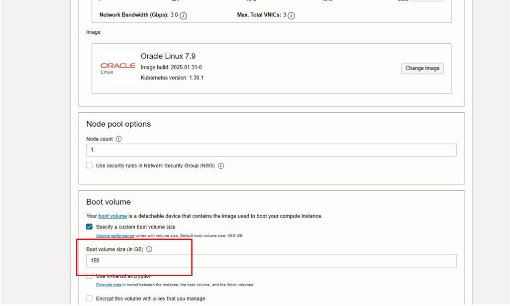

# Demo: Boot Volume Space Usage on OKE Nodes
This guide provides a complete, step-by-step process for expanding the boot volume of an OKE worker node. We will resize the underlying boot volume in OCI and then extend the partition and filesystem on the node itself using command-line tools.

## Overview

This document details the usage and allocation of space on the boot volume for worker nodes in an Oracle Kubernetes Engine (OKE) cluster. The analysis is based on a test cluster with a specific configuration to illustrate how the operating system and Kubernetes use the available space by default. 📦

### Prerequisites

* An active OKE cluster.
* `kubectl` configured to communicate with your cluster.
* `SSH`access to the worker node you wish to expand (e.g., as the opc user).
* **OCI Console** access with permissions to manage Block Volumes and Compute Instances.


## Test Environment Configuration

For this demonstration, an OKE cluster was provisioned with the following specifications:

* **Worker Nodes:** 1
* **Kubernetes Version:** `v1.30.1`
* **Operating System Image:** Oracle Linux 7.9
* **Boot Volume Size:** 100 GB
* **Initialization Script:** **None used**. The node was configured using the default values and partitions provided by OKE.

### Step 1: Create an OKE Cluster
In the OCI Console, navigate to the following path to create the cluster: **Developer Services > Containers & Artifacts > Kubernetes Clusters (OKE)**.


### Step 2: Create an OKE Cluster
In the OCI Console, navigate from the main menu to verify the boot volume's size. * Go to: **Block Storage > Boot Volumes** * Verify that the boot volume for your worker node is **100 GB**.


## Boot Volume Space Allocation

When an OKE worker node is provisioned without an initialization script to modify the partitions, the boot volume space is distributed as follows:

* **/ (Root Partition):** Contains the operating system, Kubernetes binaries (like `kubelet`), container runtimes (like `containerd`), and other system files. By default, OKE allocates a fixed portion of the space to this partition.
* **/var/lib/containerd:** This is the directory where `containerd` stores container images and snapshots of running containers. It is one of the areas that grows the most in an active cluster.
* **/var/lib/kubelet:** A directory used by the `kubelet` to manage volumes, pods, and other resources.

On a **100 GB** volume, the root partition (`/`) typically receives a size of approximately **39 GB**. The remaining space is allocated to other partitions or left as unallocated space, which can be used for logical volume expansion if configured.

```
### 📊 Distribution Example

Below is an example of what the space distribution looks like when running the `df -h` command on the node:

```bash
Filesystem      Size  Used Avail Use% Mounted on
/dev/sda3        39G  5.5G   34G  15% /
/dev/sda1       200M  8.4M  192M   5% /boot
...

```
And the disk structure with `lsblk`:

Bash

```
NAME   MAJ:MIN RM  SIZE RO TYPE MOUNTPOINT
sda      8:0    0  100G  0 disk
├─sda1   8:1    0  200M  0 part /boot
├─sda2   8:2    0    1G  0 part [SWAP]
└─sda3   8:3    0   39G  0 part /
```

### Step 3: Inspect the worker node using SSH
To inspect the node, connect to it using **SSH** and the **private key** that corresponds to the public key you assigned during cluster creation. 

1. Find the **Public IP** of your worker node in the OCI console under the node's details. 
2. Run the following command in your terminal, replacing the placeholders:
    ```bash
    ssh -i /path/to/your/private_key opc@<WORKER_NODE_IP>
    ```


### Step 4: Verify the space allocation
Once you're connected to the worker node, execute the `df -h` command to check the file system's disk space usage in a human-readable format.

1.  Run the following command in your terminal
    ```bash
    df -h
    ```


You will notice that the root partition (`/dev/sda3`) shows a size smaller than the total provisioned boot volume. For instance, on a 100 GB boot volume, the root partition may only be around 39 GB. The remaining space is unallocated.

### How is the space distributed?

The `df -h` command only shows mounted filesystems, not the entire disk structure.

-   **/dev/sda3**: This is your root partition (`/`), where the operating system and most files reside. As you can see, it's currently 39G.
    
-   **/dev/sda1**: This is the EFI system partition, which is necessary for booting the server and has a small, fixed size.
    
-   **tmpfs**: These are temporary filesystems that exist in memory (RAM), not on your physical disk.
    

The remaining ~60GB of your 100GB boot volume is currently **unallocated space** on the disk (`/dev/sda`). You need to perform a few steps to make the operating system use it.

### How do you use all the provisioned boot space?

OCI provides a utility that automates this process. You can extend the partition and the filesystem with a single command.

Bash

```
sudo /usr/libexec/oci-growfs
```


df -h

**Verify the change** by running `df -h` again. You should now see that the size of your root partition (`/dev/sda3`) is close to 100G.


## Expanding the Boot Volume for an Existing Node

To increase the size of the boot volume for a worker node in **Oracle Cloud Infrastructure (OCI)**. The process consists of two main parts: resizing the volume in the OCI console and then applying the changes within the instance's operating system.

### Part A: Resize the Boot Volume in the OCI Console

1.  Navigate to **Block Storage** > **Boot Volumes** in the OCI console menu. Click on the name of the boot volume you want to resize.


    
2.  Click the action menu (three dots) and select
    
    **Edit**.
 
  
    
3.  In the **Volume size (in GB)** field, enter the new, larger size and click **Save Changes**. The volume state will change to "Updating" and then back to "Available" once resized.
    
  
   
 
### Part B: Extend the Partition in the Operating System

After the volume is resized in the console, connect to the worker node via SSH to perform the following steps.

1.  **Rescan the Disk**: Run the following commands to make the operating system recognize the new volume size. This command should target the disk, for example,
    
    `/dev/sda`.
    
    Bash
    
    ```
    # Rescan the SCSI device
    sudo dd iflag=direct if=/dev/sda of=/dev/null count=1
    
    # Instruct the kernel to rescan the block device
    echo "1" | sudo tee /sys/class/block/sda/device/rescan
  
    ```
     
     
2.  **Extend the Filesystem**: Use the OCI utility script to automatically grow the root partition to use the newly available space.
    
    Bash
    
    ```
    sudo /usr/libexec/oci-growfs 
    ```
    
    Confirm the expansion when prompted by typing
    
    `y`.

     
    
3.  **Verify the New Size**: Run `df -h` again to confirm that the root partition (`/dev/sda3`) now shows the expanded size.
     

## Automating Expansion for New Worker Nodes

The most efficient method is to have the boot volume expanded automatically when new worker nodes are created. This is achieved by using a `cloud-init` initialization script during the node pool creation.

1.  **Configure Node Pool**: When creating a new node pool in your OKE cluster, specify a custom **Boot volume size (in GB)**.

     
    
2.  **Add Initialization Script**:
    
    -   In the "Node pool options", scroll down and expand **Show advanced options**. Locate the **Initialization script** section. Choose to **Paste Cloud-Init Script** or upload a `sample-cloud-init.sh` file. This script will contain the necessary commands to automatically expand the filesystem upon first boot.
  
    sample-cloud-init.sh

    Bash
    
    ```
    #!/bin/bash
    # --- Standard OKE initialization template ---
    curl --fail -H "Authorization: Bearer Oracle" -L0 http://169.254.169.254/opc/v2/instance/metadata/oke_init_script | base64 --decode >/var/run/oke-init.sh
    bash /var/run/oke-init.sh
    
    # This script is executed by cloud-init on the first boot of a new OKE node.
    # It expands the root filesystem and logs the output.
    LOG_FILE="/var/log/custom_node_setup.log"
    
    # Run the oci-growfs command with the -y flag for non-interactive execution.
    # We redirect both standard output (stdout) and standard error (stderr) to the log file.
    echo "Attempting to expand the root filesystem..." >> $LOG_FILE
    #sudo dd iflag=direct if=/dev/sda of=/dev/null count=1
    sudo /usr/libexec/oci-growfs -y >> $LOG_FILE 2>&1

    # Log the final state of the filesystem for easy verification.
    echo "Filesystem expansion complete. Final disk usage:" >> $LOG_FILE
    df -h / >> $LOG_FILE
    
    ```   

        
        
3.  **Create Node Pool**: Proceed with the creation of the node pool. Once the worker nodes are provisioned, they will automatically have their root partition expanded to the full size of the boot volume, with no manual intervention needed.
   
      

5.  **Verify the Size**: Run `df -h` again to confirm that the root partition (`/dev/sda3`) shows the custom size.

     

7.  **Check Logs** You can view the logs from your `cloud-init` script to confirm it ran successfully and confirm that the root partition (`/dev/sda3`) was expanded.
   
     
